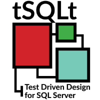

@title[Adding unit tests with tSQLt to the database deployment pipeline]

## Adding unit tests with tSQLt to the database deployment pipeline

### Eduardo Piairo

#sqlsatcambridge

---

## About Me

### Eduardo Piairo

    DevOps Coach @ Natixis | Founder DevOps Porto | Friend of Redgate

@fa[twitter] @EdPiairo  
@fa[globe] www.eduardopiairo.com  
@fa[envelope] eduardopiairo@gmal.com  
@fa[linkedin] www.linkedin.com/in/eduardopiairo  

---

## tSQLt

Database unit testing framework for Microsoft SQL Server

    <ul class="smallText">
        <li >‎Allow to write T-SQL code as tests</li></li>
        <li>Tests are automatically run within transactions</li>
        <li>Provides a way to isolate code and tables using mocking</li>
        <li>Output can be plain text or XML</li>
    </ul>

---

## tSQLt Install

* tSQLt.class.sql 
  * CLR
    * clr enabled
    * clr strict security
  * Should be installed in the development database

---

## What's a tSQLt test?

* Stored Procedure
    * Starts with the word **test**
    * Must be in a schema that contains the extended property tSQLt.TestClass = 1
        * tSQLt.NewTestClass
    * Each test is wrapped in a transaction
        * Modifications are rolled back and the results saved

---

## What's a tSQLt test?

* Benefits
    * Business requirements documentation
    * Code refactoring
    * Isolation - unrelated changes do not affect other parts of the system
    * Help structure code into distinct components – keep it small
